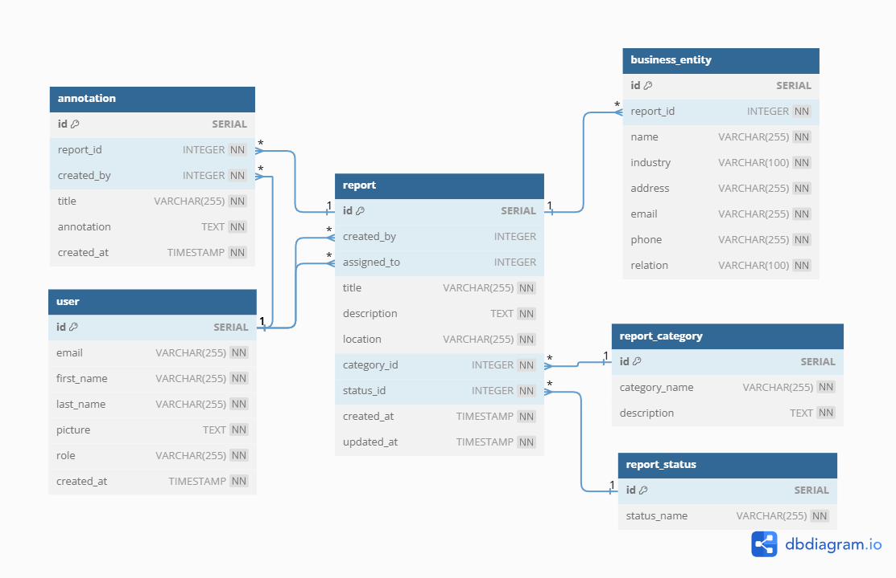

# Fraud Fighters

A full-stack web application for reporting financial crimes like fraud, money laundering, and tax evasion.

## Table of Contents

- [Public API](#api-public)
- [Deployment](#deployment)
- [Features](#features)
- [Technologies](#technologies)
- [API Documentation](#api-documentation)
- [Database](#database)

## Pulic API

- Alternatively to using the web based reporting and management application, anonymous reports can be made using public API calls:
  - Post Anonymous Report: https://zj6lfhgilj.execute-api.us-east-1.amazonaws.com/report-public
    - Expected Body Format:
    '''{
        title: Title,
        description: Description,
        location: Primary Location of Crime,
        status_id: 1,
        category_id: Crime Category ID,
        business_entities: [
          {
            name: Business Name,
            industry: Industry,
            address: Business Address,
            email: Business Email,
            phone: Business Phone Number(of type string),
            relation: Relation to Alleged Crime
          },...
        ]
    }'''

## Deployment

- The app is deployed on **AWS**:
  - Frontend: http://fraud-fighters-fe.s3-website-us-east-1.amazonaws.com
  - Backend: https://zj6lfhgilj.execute-api.us-east-1.amazonaws.com

## Features

- Anonymous Reporting: Allows anyone to report financial crimes without creating an account.
- Role-Based Access:
  - Handler: Can view and update reports.
  - Admin: Full access to manage reports and assign handlers to reports
- OAuth Integration: User authenication via Google OAuth.
- Microservice Architecture: Backend with RabbitMQ for communication between microservices.
- CI/CD Pipeline: Automatic deployment of frontend updates via GitHub Actions.

## Technologies

- **Frontend**: Angular, Tailwind CSS, Flowbite
- **Backend**: NestJS with microservices, RabbitMQ, TypeORM
- **Database**: AWS Aurora PostgresSQL
- **Deployment**: AWS S3, AWS EKS, AWS Lambda, AWS API Gateway

## API Documentation

### Routes:

#### 1. **Annotation**

- `GET /annotation`: Retrieve all annotations.
- `POST /annotation`: Create a new annotation.
- `GET /annotation/:id`: Get a specific annotation by ID.
- `PUT /annotation/:id`: Update an annotation by ID.
- `DELETE /annotation/:id`: Delete an annotation by ID.

#### 2. **Business Entity**

- `GET /business-entity`: Retrieve all business entities.
- `POST /business-entity`: Create a new business entity.
- `GET /business-entity/:id`: Get a specific business entity by ID.
- `PUT /business-entity/:id`: Update a business entity by ID.
- `DELETE /business-entity/:id`: Delete a business entity by ID.

#### 3. **Report Category**

- `GET /report-category`: Retrieve all report categories.
- `POST /report-category`: Create a new report category.
- `GET /report-category/:id`: Get a specific report category by ID.
- `PUT /report-category/:id`: Update a report category by ID.
- `DELETE /report-category/:id`: Delete a report category by ID.

#### 4. **Report Status**

- `GET /report-status`: Retrieve all report statuses.
- `POST /report-status`: Create a new report status.
- `GET /report-status/:id`: Get a specific report status by ID.
- `PUT /report-status/:id`: Update a report status by ID.
- `DELETE /report-status/:id`: Delete a report status by ID.

#### 5. **Report**

- `GET /report`: Retrieve all reports.
- `POST /report`: Create a new report.
- `GET /report/:id`: Get a specific report by ID.
- `PUT /report/:id`: Update a report by ID.
- `DELETE /report/:id`: Delete a report by ID.

#### 6. **User**

- `GET /user`: Retrieve all users.
- `POST /user`: Create a new user.
- `GET /user/:id`: Get a specific user by ID.
- `PUT /user/:id`: Update a user by ID.
- `DELETE /user/:id`: Delete a user by ID.

#### 7. **Auth**

- `GET /auth/google`: Redirects to Google OAuth for authentication.
- `GET /auth/google/callback`: Callback route for Google OAuth.

## Database

- **Database**: AWS Aurora PostgreSQL.
- **Tables**:
  - **Reports**: Stores all report data.
  - **Business Entities**: Stores entities involved in report.
  - **Report Categories**: Defines categories of financial crime reports.
  - **Report Statuses**: Tracks the status of each report (e.g., pending, investigating, closed).
  - **Annotations**: Stores additional details related to a report.
  - **Users**: Stores user information and authentication details.

### Entity Relational Diagram:

